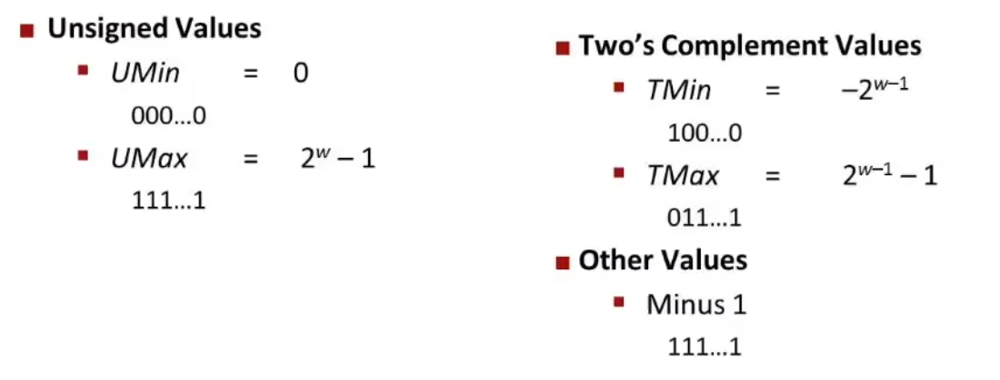
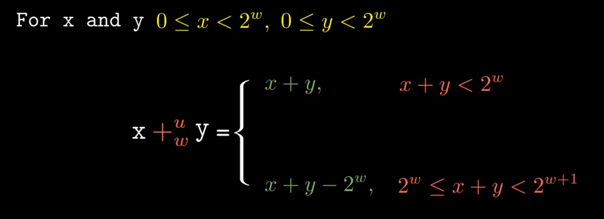
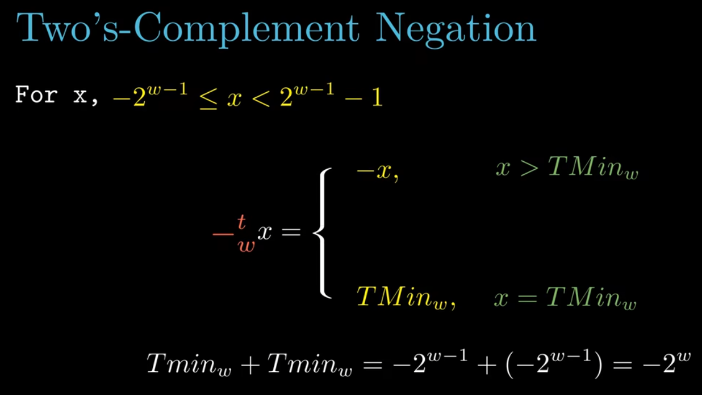
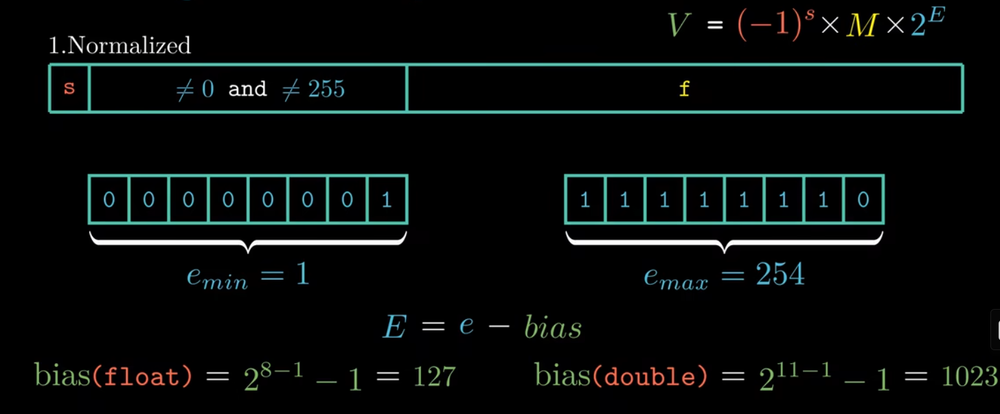
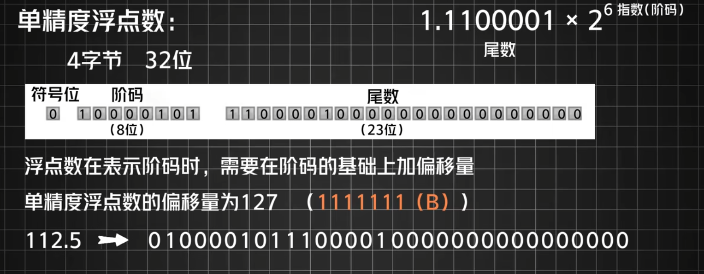
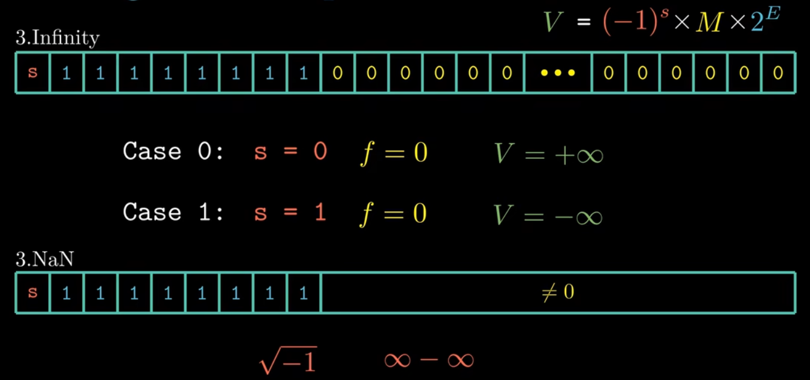

# CSAPP: DATALAB

## datalab前置内容自用笔记:

c++中基本数据类型，以及1byte = 8bits

字长: 对于32位的机器，一个字长就是4个字节，而对于64位则对应8个字节

| C Data Type | Typical 32-bit | Typical 64-bit | x86-64 |
| ----------- | -------------- | -------------- | ------ |
| char        | 1              | 1              | 1      |
| short       | 2              | 2              | 2      |
| int         | 4              | 4              | 4      |
| long        | 4              | 8              | 8      |
| float       | 4              | 4              | 4      |
| double      | 8              | 8              | 8      |
| long double | -              | -              | 10/16  |
| pointer     | 4              | 8              | 8      |

## 常见的位运算操作：

### 一、按位与（&）

- 运算规则：
  - 当两个操作数的对应位都为 1 时，结果位才为 1，否则为 0。
- 示例：
  - 假设 `a = 5`（二进制为 `0101`），`b = 3`（二进制为 `0011`），则 `a & b` 的结果为 `0001`，即十进制的 `1`。

### 二、按位或（|）

- 运算规则：
  - 当两个操作数的对应位只要有一个为 1，结果位就为 1，只有当两个对应位都为 0 时，结果位才为 0。
- 示例：
  - 对于上面的 `a = 5`（二进制 `0101`）和 `b = 3`（二进制 `0011`），`a | b` 的结果为 `0111`，即十进制的 `7`。

### 三、按位异或（^）

- 运算规则：
  - 当两个操作数的对应位不同时，结果位为 1，相同时结果位为 0。
- 示例：
  - 同样对于 `a = 5` 和 `b = 3`，`a ^ b` 的结果为 `0110`，即十进制的 `6`。

### 四、按位取反（~）

**按位取反与!不同，一定作好区分**

- 运算规则：
  - 对操作数的每一位进行取反操作，0 变为 1，1 变为 0。
- 示例：
  - 若 `a = 5`（二进制 `0101`），`~a` 的结果为 `1010`，在有符号整数表示中，其十进制值为 `-6`（因为在计算机中，负数是以补码形式存储的）。

### 五、左移（<<）

- 运算规则：
  - 将操作数的各二进制位全部左移若干位，左边溢出的位被舍弃，右边补 0。
- 示例：
  - 设 `a = 5`（二进制 `0101`），`a << 2` 的结果为 `010100`，即十进制的 `20`，相当于将原数乘以 `2` 的移动位数次方（这里是 `2^2 = 4`，`5 * 4 = 20`）。

### 六、右移（>>）

- 运算规则：
  - 将操作数的各二进制位全部右移若干位，右边溢出的位被舍弃。对于无符号数，左边补 0；对于有符号数，如果原数是正数，左边补 0，如果原数是负数，左边补 1（保持符号不变）。
- 示例：
  - 对于 `a = 5`（二进制 `0101`），`a >> 1` 的结果为 `0010`，即十进制的 `2`，相当于将原数除以 `2` 的移动位数次方（这里是 `2^1 = 2`，`5 / 2 = 2`，向下取整）。

### 对于右移：

arithmetic shift 即算术右移，它是一种针对有符号整数的移位操作，与逻辑右移共同构成了移位运算体系。其核心特性是在移位过程中保持操作数的符号不变

- **原理**：算术右移在对有符号整数进行右移操作时，符号位（最高位）保持不变，而数据位依次向右移动，右侧移出的位直接丢弃，左侧空位依据符号位填充。对于正数，符号位为 0，空位补 0；对于负数，符号位为 1，空位补 1。这一操作相当于将原数值除以 2（向下取整），且不会改变数据的正负性，能保留数据的符号属性，维持数据意义。

logic shift是逻辑右移，左侧空出位直接补0.

**而对于c语言实现中，基本对于有符号数实现算术右移，而对无符号数实现逻辑右移**

# 码制：

## 原码：

至少在这里不是很重要

## 补码(two's compliment):

为什么叫做two's compliment，建议参考阮老师的文章:[关于2的补码](https://www.ruanyifeng.com/blog/2009/08/twos_complement.html)。理解了补码，基本也就理解了计算机加减的本质。(当然，这不影响我吐槽这个计算机术语起得真烂，以为跟反码一个东西，但compliment的东西一点都不同)



## 反码(ones‘ compliment)：

反码从英文原意上我们看不出"反"是从哪翻译来的，反而"Complement"更容易让我们理解成“补”，那为什么这个不叫补码而叫反码呢？其实反码的英文直译过来就是“1的补集”。注意One是带"s"的，说明是一或多个1。其实反码的定义来源于它原来的计算方式，也就是-x的反码为：

```
-x = [11111...1] - x
```

## 数据类型转换出现的各种溢出计算：

图片取材于b站up[九曲阑干](https://space.bilibili.com/354767108)

## 加法:

### 对于无符号数：

```c
unsigned char a = 255 (11111111);

unsigned char b = 1 (00000001);

unsigned char c = a + b; (100000000) //发生溢出
```

运行结果c=0



### 对于有符号数：

与上述同理


### 加法逆元：



其实就理解为对应的减法就可以了

## 乘法与除法：

**截断操作即为取模运算**

编译器很多时候将乘法运算转化为移位和加减运算

对于除法运算，为了保证取值的精确性，需要加偏置


# 浮点数：

## 1.Normalized



作为例子来理解阶码，尾数，和符号位：



## 2.Denormalized


## 3.Infinity



# CS:APP 数据实验室

**原汁原味实验，取材于cmu官方网站，用gpt作了翻译**

请在此处填写您的姓名和用户 ID。

bits.c - 包含您对本实验解决方案的源文件，这是您需要提交给导师的文件。

**警告**：请勿包含`<stdio.h>`头文件，它会使 dlc 编译器产生混淆。即便不包含`<stdio.h>`，您仍可使用`printf`进行调试，不过可能会收到编译器警告。一般而言，忽视编译器警告并非良好的编程习惯，但在本实验中可以这么做。

## 给学生的说明

### 第一步：仔细阅读以下说明

您需通过编辑此源文件中的函数集，来完成数据实验室的任务。

### 整数编码规则

将每个函数中的 “return” 语句替换为一行或多行 C 代码，以实现函数功能。代码必须符合以下风格：

```c
int Funct(arg1, arg2, ...) {
    /* 简要描述您的实现方式 */
    int var1 = Expr1;
    ...
    int varM = ExprM;
    varJ = ExprJ;
    ...
    varN = ExprN;
    return ExprR;
}
```

每个 “Expr” 是仅使用以下内容构成的表达式：

1. 整数常量 0 至 255（0xFF），包含边界值。禁止使用如 0xffffffff 这样的大常量。
2. 函数参数和局部变量（不能使用全局变量）。
3. 一元整数运算符！~ 。
4. 二元整数运算符 & ^ | + <<>> 。

部分问题对允许使用的运算符限制更为严格。每个 “Expr” 可由多个运算符组成，且每行不限于一个运算符。

明确禁止您：

1. 使用任何控制结构，如 if、do、while、for、switch 等。
2. 定义或使用任何宏。
3. 在此文件中定义额外的函数。
4. 调用任何函数。
5. 使用诸如 &&、||、- 或？: 等其他运算符。
6. 使用任何形式的类型转换。
7. 使用除 int 以外的任何数据类型，这意味着不能使用数组、结构体或联合体。

您可以假设您的机器：

1. 采用 2 的补码、32 位整数表示形式。
2. 执行算术右移操作。
3. 当移位量小于 0 或大于 31 时，移位操作的行为不可预测。

可接受的编码风格示例：

```c
/*
 * pow2plus1 - 返回2^x + 1，其中0 <= x <= 31
 */
int pow2plus1(int x) {
    /* 利用移位运算计算2的幂次方 */
    return (1 << x) + 1;
}
```

```c
/*
 * pow2plus4 - 返回2^x + 4，其中0 <= x <= 31
 */
int pow2plus4(int x) {
    /* 利用移位运算计算2的幂次方 */
    int result = (1 << x);
    result += 4;
    return result;
}
```

### 浮点编码规则

对于需要您实现浮点运算的问题，编码规则相对宽松。您可以使用循环和条件控制结构，也可以使用 int 和 unsigned 类型，并且能够使用任意整数和无符号常量，对 int 或 unsigned 数据进行任何算术、逻辑或比较运算。

但明确禁止您：

1. 定义或使用任何宏。
2. 在此文件中定义额外的函数。
3. 调用任何函数。
4. 使用任何形式的类型转换。
5. 使用除 int 或 unsigned 以外的任何数据类型，这意味着不能使用数组、结构体或联合体。
6. 使用任何浮点数据类型、运算或常量。

### 注意事项

1. 使用 dlc（数据实验室检查器）编译器（讲义中有介绍）检查您的解决方案是否符合规则。
2. 每个函数在实现时，都有允许使用的最大操作数限制（包括整数、逻辑或比较操作），dlc 会检查最大操作数。注意，赋值（'='）操作不计入其中，您可以按需使用，不会受到惩罚。
3. 使用 btest 测试框架检查函数的正确性。
4. 使用 BDD 检查器正式验证函数。
5. 每个函数的最大操作数在函数头部注释中给出。若文档说明与本文件中的最大操作数不一致，请以本文件为准。

### 第二步：根据编码规则修改以下函数

重要提示：为避免评分出现意外情况：

1. 使用 dlc 编译器检查您的解决方案是否符合编码规则。
2. 使用 BDD 检查器正式验证您的解决方案能得出正确答案。

### 函数题目说明

1. bitXor

    

   \- 仅使用～和 & 实现 x^y 。

   - 示例：bitXor (4, 5) = 1 。

   - 合法运算符：~ & 。

   - 最大操作数：14 。

   - 难度评级：1 。

     我的解答：

     ```c
     int bitxnor(int x,int y){
         return ~(~((~x)&y)&(~(x&(~y))));
     }
     ```

     简单的异或变换，电子电路里面就学过了。

2. tmin

    

   \- 返回最小的补码整数。

   - 合法运算符：! ~ & ^ | + <<>> 。

   - 最大操作数：4 。

   - 难度评级：1 。

     我的解答：

     ```c
     int tmin(void) {
         return 1<<31;
     }
     ```

     也是比较简单的一题，对于补码表示下的计算1000...000即代表最小的补码整数，故只需将1（000...1)左移对应的位数

3. isTmax

    

   \- 若 x 是最大的补码数，返回 1；否则返回 0。

   - 合法运算符：! ~ & ^ | + 。

   - 最大操作数：10 。

   - 难度评级：1 。

     我的解答：

     ```c
     int isTmax(int x) {
       return !(x^0x7fffffff);
     }
     ```

     最大的补码数，自然是-1（1111....1),但这里不能用if语句，判断相等，从而想到异或，那么再借助!运算即可

4. allOddBits

    

   \- 若字中所有奇数位都设置为 1，则返回 1，位的编号从 0（最低有效位）到 31（最高有效位）。

   - 示例：allOddBits (0xFFFFFFFD) = 0，allOddBits (0xAAAAAAAA) = 1 。

   - 合法运算符：! ~ & ^ | + <<>> 。

   - 最大操作数：12 。

   - 难度评级：2 。

     我的解答：

     ```c
     int allOddBits(int x) {
       return !((x^0xAAAAAAAA)&0xAAAAAAAA);
     }
     ```

     在这里其实和上题思路差不多，用异或来给出它的奇数位是什么状态，再用&判断奇数位是否，所以直接与题干的(0xAAAAAAAA)比较即可

5. negate

    

   \- 返回 -x 。

   - 示例：negate (1) = -1 。

   - 合法运算符：! ~ & ^ | + <<>> 。

   - 最大操作数：5 。

   - 难度评级：2 。

     难度评级：2 。

     我的解答：

     ```c
     int negate(int x) {                              return ~x+1;                           }  
     ```

     采用取反+1求补码即可，应该是最简单的一道

6. isAsciiDigit

    

   \- 若 0x30 <= x <= 0x39（即字符 '0' 到 '9' 的 ASCII 码），返回 1。

   - 示例：isAsciiDigit (0x35) = 1，isAsciiDigit (0x3a) = 0，isAsciiDigit (0x05) = 0 。

   - 合法运算符：! ~ & ^ | + <<>> 。

   - 最大操作数：15 。

   - 难度评级：3 。

     我的解答:

     ```c
     int lower = (x + (~0x30 + 1)) >> 31;  // 如果 x < 0x30，lower 为 -1，否则为 0
         int upper = (0x39 + (~x + 1)) >> 31; // 如果 x > 0x39，upper 为 -1，否则为 0
         return!(lower | upper);         // 当 lower 和 upper 都为 0 时，结果为 1，否则为 0
     ```
     
     没有想出来，参考了一下他人的解法，已经成为csapp上教授所说的学术欺骗了...这里最主要的是范围表示，如何表达出两种界限。以及提醒我是可以设置变量的来着...写上面一直在return上写有点昏头了

7. conditional

    

   \- 功能等同于 x ? y : z 。

   - 示例：conditional (2, 4, 5) = 4 。

   - 合法运算符：! ~ & ^ | + <<>> 。

   - 最大操作数：16 。

   - 难度评级：3 。

     我的解答：

     ```c
     int is0 = !(!(x^0x00000000)); 
       is0 = ~is0 + 1;
       int a = y&(is0);
       int b = z&(~(!(is0))+1);
       return a^b;    
     ```
     
     经典的三目运算符，x为条件，x为真选择y，x为假选择z，那么首先需要判断x是否为0，非0时即会被判断为true，借助3t的思路来判断，最后需要选择，由于与0&的始终为0，这里我们可以用^来表示加法，并且我们需要拿到-1来做&运算，所以选择了两次求补，不过感觉我这个代码又丑又难懂...(老是记不住运算顺序，于是<s>谨慎</s>菜菜的加上了小括号)

8. isLessOrEqual

    

   \- 若 x <= y ，返回 1；否则返回 0。

   - 示例：isLessOrEqual (4, 5) = 1 。

   - 合法运算符：! ~ & ^ | + <<>> 。

   - 最大操作数：24 。

   - 难度评级：3 。

     我的解答：

     ```c
     int isLessOrEqual(int x, int y) {
         int sign_x = (x >> 31) & 1;  // 获取 x 的符号位
         int sign_y = (y >> 31) & 1;  // 获取 y 的符号位
         int diff = y + (~x + 1);  // 计算 y - x，使用补码运算
         int sign_diff = (diff >> 31) & 1;  // 获取 y - x 的符号位
      // 当 x 和 y 符号相同时，根据 y - x 的符号位判断大小
         int same_sign =!(sign_x ^ sign_y); 
         int case1 = same_sign & (!sign_diff); 
        // 当 x 为负，y 为正，x < y
         int case2 = sign_x & (!sign_y); 
         return case1 | case2; 
     }
     ```

     判断是否相等，那就判断两者相减后异或的符号位是否为0，然后卡在了如何区分相等和小于的情况，苦耗无果后再次cheat...于是再次学到了一些有用的符号位比较小技巧

9. logicalNeg

    

   \- 除！以外，使用所有合法运算符实现！运算符功能。

   - 示例：logicalNeg (3) = 0，logicalNeg (0) = 1 。

   - 合法运算符：~ & ^ | + <<>> 。

   - 最大操作数：12 。

   - 难度评级：4 。

     我的解答：

     ```c
     int logicalNeg(int x) {    
       int neg = ~x + 1;
       int nsign = (neg >> 31)&1;
       int sign = (x>>31)&1;
       return (nsign | sign)&1;                                                           }   
     ```

     这里主要是如何区分0和其它数，想到0^0依然为0，而非0时一个数正负数的符号位肯定是不一致的（其实感觉和上道题有点类似），那么我们只需要判断这个数取-后右移31位后是否相等即可，感觉没上道难度大，当然，也是上一道让我明白了这一道怎么做，也算触类旁通（？

10. howManyBits

     

    \- 返回以补码形式表示 x 所需的最少位数。

    - 示例：howManyBits (12) = 5，howManyBits (298) = 10，howManyBits (-5) = 4，howManyBits (0) = 1，howManyBits (-1) = 1，howManyBits (0x80000000) = 32 。

    - 合法运算符：! ~ & ^ | + <<>> 。

    - 最大操作数：90 。

    - 难度评级：4 。

      我的解答：

      ```c
      int howManyBits(int x) {
          int sign = x >> 31;
          int y = (sign & ~x) | (~sign & x);
          int b16 = (!(!(y>>16)))<<4;
          y = y >> b16;
          int b8 = (!(!(y>>8)))<<3;
          y = y >> b8;
          int b4 = (!(!(y>>4)))<<2;
          y = y >> b4;
          int b2 = (!(!(y>>2)))<<1;
          y = y >> b2;
          int b1 = (!(!(y>>1)));
          y = y >> b1;
          int b0 = y;
          return b16 + b8 + b4 + b2 + b1 + b0 + 1;
      }
      ```

      想了特别久，中间甚至隔了一天，最后在其它地方看到一个跟二分有关的东西想起来这个地方可以用二分尝试一下，写完最激动的一集，这就是顿悟的魅力啊，另外，符号位真的是比较判断很重要的一环，没有思路取下符号位看一看

11. floatScale2

     

    \- 返回表达式 2*f 的位级等效值，f 为浮点参数。参数和结果均以 unsigned int 形式传递，但需将它们解释为单精度浮点值的位级表示。当参数为 NaN 时，返回该参数。

    - 合法运算符：任何整数 / 无符号整数运算，包括 ||、&&，以及 if、while 。

    - 最大操作数：30 。

    - 难度评级：4 。

      我的解答：

      ```c
      
      ```

      解除封印后的第一题，然后

12. floatFloat2Int

     

    \- 返回表达式 (int) f 的位级等效值，f 为浮点参数。参数以 unsigned int 形式传递，但需将其解释为单精度浮点值的位级表示。任何超出范围的值（包括 NaN 和无穷大）应返回 0x80000000u。

    - 合法运算符：任何整数 / 无符号整数运算，包括 ||、&&，以及 if、while 。

    - 最大操作数：30 。

    - 难度评级：4 。

      我的解答：

      ```c
      
      ```

      

13. floatPower2

     

    \- 返回表达式 2.0^x 的位级等效值，x 为任意 32 位整数。返回的无符号值应与单精度浮点数 2.0^x 具有相同的位表示。若结果太小，无法表示为非规格化数，则返回 0；若太大，则返回 + INF。

    - 合法运算符：任何整数 / 无符号整数运算，包括 ||、&&，以及 if、while 。
    
    - 最大操作数：30 。
    
    - 难度评级：4 。
    
      我的解答：
    
      ```c
      
      ```
    
      

​                                          

# cry的datalab做后总结：

兜兜转转做了3天左右，浮点数，拼尽全力无法战胜😭。
